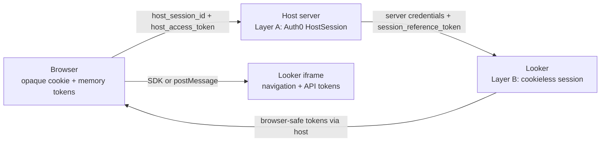

# Architecture: nested cookieless sessions

This lab demonstrates a design method: keep durable identity and renewal power
on the server, and give the browser only narrow, short-lived handles.

For setup and the demo, start with [README.md](README.md). For a shorter
question-and-answer version, read
[docs/cookieless-brief.md](docs/cookieless-brief.md). Coding tools start at
[AGENTS.md](AGENTS.md).

This page is the mental model. Token inventory, storage, renew functions,
User-Agent rules, logout steps, and embed-client detail live in
[docs/agent/CONTEXT.md](docs/agent/CONTEXT.md). File and route maps live in
[docs/agent/CODEMAP.md](docs/agent/CODEMAP.md).

## Why cookieless exists

A Looker iframe is normally cross-site. Its Looker session cookie is therefore a
third-party cookie, which browsers may block or partition. If Looker cannot
receive that cookie, it cannot recover the iframe's session in the usual way.

Cookieless embed makes the embedding application responsible for delivering
tokens. The host server calls privileged Looker APIs; the iframe asks for
short-lived tokens and never receives the long-lived Looker session reference.

## The two layers

| Layer | Role | Durable record | What the browser holds |
| --- | --- | --- | --- |
| A — host | Prove the user and authorize the BFF | In-memory `HostSession`, keyed by `host_session_id` | Opaque `HttpOnly` cookie plus short-lived `host_access_token` |
| B — Looker | Authorize the iframe | Looker's cookieless session, referenced by a server-held `session_reference_token` | One-use `authentication_token`, then `navigation_token` and `api_token` |

The nesting matters. Layer A gates every host endpoint that acquires, renews, or
ends Layer B. Layer B can end while the user remains logged into Layer A.

On `/lab`, constellation badges are **Auth0**, **Host**, or **Looker**. Layer A
includes both Auth0 tokens and host tokens. `host_access_token` is a **Host**
JWT. “Consumed by `/api/looker/*`” means it is the bearer that *gates* Looker
calls; it is not Looker's `api_token` and not Auth0's access token.

The cookie only finds the HostSession. The host JWT is the short-lived
authorization for protected BFF routes. Auth0 tokens and
`session_reference_token` never enter browser JSON, URLs, or browser storage.

## Lifetimes teach the nesting

Repository defaults used by this lab: host JWT **200** s
(`HOST_ACCESS_TOKEN_TTL_SECONDS` in `app/config.py`, not `.env`) and Looker
session length **720** s (`LOOKER_EMBED_SESSION_LENGTH`). The opaque host cookie
lasts hours so Layer A can outlive many Looker sessions. Auth0 durations come
from the tenant. Looker returns the individual authentication / navigation /
API / session-reference TTLs; the UI follows those values.

`navigation_token` and `api_token` are siblings, not aliases: usually minted
together, each with its own clock. Neither one is the embed session.

### Looker cookieless contract

These are the four tokens from `acquire_embed_cookieless_session`. Usual
Looker lifetimes are below. A given response can differ; the UI follows the
TTLs Looker returned.

| Token | Usual lifetime | Who holds it | What ends it |
| --- | --- | --- | --- |
| `authentication_token` | about 30 seconds | Embed login URL, once | Use on `/login/embed`, or the 30-second TTL |
| `navigation_token` | about 10 minutes | Iframe | Its own `exp`, then `generate_tokens` replaces it |
| `api_token` | about 10 minutes | Iframe | Its own `exp`, then `generate_tokens` replaces it |
| `session_reference_token` | `session_length` (lab default 720 s) | Server only | TTL 0, End Looker, or logout |

`navigation_token` authorizes movement inside the embed. `api_token` authorizes
Looker API calls the iframe makes. They are sibling JWTs. Acquire and generate
usually mint them together. Each response still carries its own TTL, so the
clocks can diverge. Neither one is the embed session.

Neither request can ask Looker for a shorter navigation or API lifetime. With
a session longer than about 10 minutes, Looker returns about 10 minutes. Those
tokens cannot outlive the session, so a shorter `LOOKER_EMBED_SESSION_LENGTH`
caps both of them, including tokens from later `generate_tokens` calls.

`session_reference_token` is that session. It cannot be refreshed.
`generate_tokens` returns the remaining `session_reference_token_ttl` and leaves
the original countdown in place. A replacement reference string, when Looker
sends one, is stored on the server and does not restart the countdown. Reattach
(acquire again with the stored reference) mints a new `authentication_token`
for another iframe and ignores `session_length`. The same session bar continues.
A new countdown starts only from an acquire that does not send a live
reference: End Looker, then acquire again.

The number in `app/config.py` is a fallback. If `.env` sets
`LOOKER_EMBED_SESSION_LENGTH`, that value is what acquire sends. Changing the
fallback while `.env` still says 720 leaves a 12-minute bar. After you change
`.env`, restart the process, then start a new Looker session. The swimlane
draws the TTL Looker returned, not the integer in the file. `/architecture`
prints the value this process actually loaded.

`authentication_token` is single-use on `/login/embed`. The lab marks it
consumed when the iframe reaches that URL. `generate_tokens` leaves it
unchanged. Its whole life is shorter than the navigation/API ask window, so
the observatory keeps it out of that window's yellow state.

### When Looker asks for new iframe tokens

Looker, inside the iframe, decides when to ask. The host does not poll Looker
for this. After the iframe loads it sends `session:tokens:request`. It sends
that again when either `navigation_token` or `api_token` is inside its last 60
seconds. The lab paints that window as the hatch
(`EXPIRING_WINDOW_SECONDS` in `app/services/observatory.py`).

What the host must do on each ask is not automatic:

| Step | Who runs it |
| --- | --- |
| Notice that nav or api is near expiry, and send `session:tokens:request` | Looker, on its own |
| First reply: hand back the navigation and API tokens from acquire, with the TTLs Looker just returned | Host code. The Embed SDK does this inside `initCookieless` if you passed an acquire callback. The raw postMessage tab does it explicitly. |
| Later reply: call `generate_tokens` and return the new navigation and API tokens, plus the **remaining** `session_reference_token_ttl` | Host code. You write this. Neither Looker nor the SDK calls Looker's generate API for you. |
| Keep `session_reference_token` on the server and send it only to Looker's generate API | Host code |
| Show "session interrupted" if the reply is missing, late, or carries a stale TTL | Looker, on its own |

`generate_tokens` rotates both siblings, including the one that still had more
than 60 seconds left. It does not extend the session. Freeze answers the ask
with the same JWTs and does not call Looker, so those windows run out on their
own `exp`.

A returned `session_reference_token_ttl` of 0 means the embed session is dead.
The lab turns that into HTTP 409 `SESSION_DEAD`. The iframe tokens may still
show time on their own clocks. Renewal still requires a new acquire.

### The Embed SDK generate gate

`@looker/embed-sdk` does not call your `generateTokens` callback on every
`session:tokens:request`. On the first ask it caches the acquire TTLs (usually
about 600 seconds for navigation and API) and sets `generateTokensTime` to
120 seconds before that cached number:

`now + (minimum of the cached TTLs − 120 seconds)`.

Later asks call `generateTokens` only when `Date.now()` is **already past**
that timestamp. The comparison in `EmbedClientEx` is `>`, so an ask that
arrives on the gate does not generate. The SDK answers with the cached acquire
TTLs, about 10 minutes, not the seconds those JWTs still have.

Looker's refresh ask lands on that same instant. The reply claims a longer
life than the JWTs have left, so Looker shows session interrupted. The host
never called `generate_tokens`. The session reference is still counting down.
The swimlane stays one navigation bar, one API bar, and no amber line.

Read it on the page timer as **first token request + 8:00**. When that first
request is about 39 seconds after load, the timer reads **8:39**. The
navigation and API JWTs still have about two minutes at that moment.

A later reply must carry the seconds still left, unless it is the fresh result
of generate. Waiting for the ask and only then opening the gate is too late:
that ask is the interrupt. This lab rewrites the cached TTLs to remaining time
every second and, with 180 seconds left, calls generate and pushes the new
tokens into the iframe. A failed generate or an interrupted iframe draws a red
line on the Looker lane.

## Acquire, renew, and login are different operations

| Operation | Teaches |
| --- | --- |
| Auth0 code exchange | Prove the user and create Layer A |
| Host bootstrap / refresh | Keep Layer A callable without a new login |
| Looker acquire | Create or reattach Layer B; issue a new one-use authentication token |
| Looker generate | Rotate navigation and API tokens under the existing Layer B identity |

Renewal is not a new login. Generate uses the server-held session reference, not
an iframe-chosen one. Zero `session_reference_token_ttl` means Layer B is dead
(HTTP 409 `SESSION_DEAD`); Layer A may still be valid, so reacquiring Looker does
not necessarily require another Auth0 login.

The host JWT is a separate clock from every Looker token. While `/lab` is open,
the browser schedules the next `POST /api/host/refresh` before that JWT expires,
and a successful refresh schedules the one after it. The cookie authorizes that
call; the expiring JWT does not. If a refresh fails, nothing is scheduled until
some later Looker call gets a 401 and tries once more. The embed can then stop
on the next `generate_tokens` while navigation and API tokens, and even the
session reference, still have time left. That is a Layer A failure. An expired
`authentication_token` is not the cause: it was already used once at
`/login/embed`.

The page does not break at the instant the host JWT expires. The dashboard
keeps the tokens it already has. The observatory keeps drawing the last
snapshot. Controls report an error when you use them. The embed stops when
Looker next asks for tokens and refresh still fails. Moving the browser clock
forward only changes those drawings and the refresh timer. The host and Looker
still honor the absolute expiry they issued. There is no clock-speed control
in this lab.

## The iframe trust boundary

The iframe may request tokens with `session:tokens:request`. It may not choose
the session reference or call Looker's privileged acquire/generate APIs.

The two lab tabs implement the same boundary differently:

- **Embed SDK:** `initCookieless` invokes host callbacks and manages iframe
  messaging.
- **Raw postMessage:** the browser validates both `event.source` and the Looker
  origin, then sends only navigation/API token fields.

The diagram at [`docs/sequence-happy-path.mmd`](docs/sequence-happy-path.mmd),
also rendered at `/sequence`, shows the raw postMessage happy path. It is not a
complete SDK trace or failure matrix.

## Reading the lifetime swimlane

The swimlane on `/lab` is the picture of this contract. Bar length is the TTL
Looker returned for that mint. The time axis runs through those Looker ends.
Host and Auth0 bars that outlive the axis end in a chevron.

| Picture | Meaning |
| --- | --- |
| One `session_reference_token` bar | Session from acquire until its countdown. `generate_tokens` leaves that bar in place. |
| Short `authentication_token` bar, with a tick | Returned single-use window. The tick is `/login/embed`. |
| Stacked `navigation_token` or `api_token` bars | Each generation keeps its own returned window. |
| Hatch at the end of a navigation or API bar | That JWT's last 60 seconds. Looker asks when either sibling enters its hatch, then rotates both. |
| Amber dashed line on the Looker and iframe lanes | `generate_tokens`. It lines up with the start of the new navigation and API bars. |
| Blue dashed line on those lanes | Looker acquire. |
| Gray dashed line on the Auth0 and Host lanes | Host JWT mint. |
| Tick on the session-reference bar, bar continues | Host dropped its copy. Looker keeps the session until the bar ends. |
| Session-reference bar stops early | End Looker, or Looker reported TTL 0. |

The iframe row uses the session-reference end while generate can still rotate
tokens. With freeze or a forced User-Agent mismatch, that row ends at the
current navigation and API expiries, because the next rotate will not happen.

History is `HostSession.looker_token_spans` (issued, expires, closed; no token
secrets). Closing a span as `refreshed` is generate. `replaced` is a later
acquire. `consumed` is embed login. `dropped` is the lab control. `revoked` is
End Looker or TTL 0. The constellation card for `authentication_token` shows
the same single-use window after it has been used.

## User-Agent and embed-domain

Looker binds a cookieless session to client context. A different User-Agent on
generate commonly produces HTTP 400. The lab forwards the **current request**
User-Agent; the mismatch control is generate-only and does not mean “always the
login UA.” Acquire sends `APP_BASE_URL` as `embed_domain`. The same origin must
be accepted by Looker.

## What `session:expired` means

`session:expired`, or `session:status` with `expired=true`, is the iframe's
session-level signal that it cannot continue. It does not independently prove
that both sibling JWT clocks expired, and it does not revoke the server's
`session_reference_token`.

Treat nav/api clocks, iframe session status, and Layer B identity as three
questions, not one bit.

## Logout in more than one browser

Each Auth0 callback creates a separate `HostSession` and cookie. The in-memory
store is keyed only by `host_session_id`; it has no user index.

`POST /logout` tears down **this** browser's HostSession (Looker end, Auth0
refresh revoke, cookie clear, Auth0 logout). Another browser's HostSession is
not deleted by this repository.

A real logout-everywhere feature must index sessions by Auth0 `sub` and revoke
every matching HostSession, Auth0 refresh token, and Looker session. That is a
separate product choice, not a property provided automatically by cookieless
embed.

## Validity is checked by layer

There is no single global “logged in” bit.

| Question | Check |
| --- | --- |
| Can the host find the session? | Cookie maps to an existing, non-revoked `HostSession` |
| Can this browser call protected host APIs? | Host JWT verifies and its `jti` matches the current HostSession value |
| Can Layer A renew? | Auth0 accepts the server-held refresh token |
| Are iframe tokens current? | Each returned TTL/expiry remains positive |
| Can Layer B renew? | Generate succeeds and session-reference TTL is nonzero |
| Can the iframe continue? | Token checks plus iframe session status |

The lab's event log and token cards expose these checks separately so a failure
in one layer is not mislabeled as a global logout.

## Moving the pattern into a real application

Keep these boundaries:

1. **Identity adapter:** Auth0 authorize, callback, token refresh, and revoke.
2. **Host session repository:** durable, encrypted server storage; opaque cookie
   lookup; user index for logout-everywhere.
3. **Host token service:** mint and verify short-lived BFF access tokens.
4. **Looker bridge:** acquire, generate, and end; explicit server-only response
   filtering.
5. **Embed client adapter:** SDK or postMessage implementation with strict
   origin/source validation.
6. **Observability:** metadata and redacted events, never raw credentials.

Replace process memory with a shared server-side store before scaling beyond
one process. Keep token ownership and response filtering at the service
boundary rather than spreading them through route or UI code.
