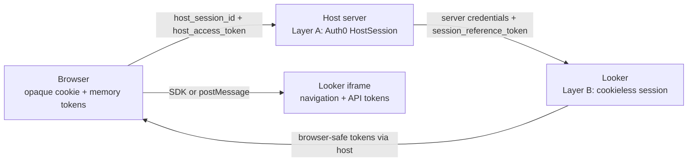

# Architecture: nested cookieless sessions

This lab demonstrates a design method: keep durable identity and renewal power
on the server, and give the browser only narrow, short-lived handles.

For setup and the demo, start with [README.md](README.md). For a shorter
question-and-answer version, read
[docs/cookieless-brief.md](docs/cookieless-brief.md). The machine-oriented map
starts at [AGENTS.md](AGENTS.md).

## Why cookieless exists

A Looker iframe is normally cross-site. Its Looker session cookie is therefore a
third-party cookie, which browsers may block or partition. If Looker cannot
receive that cookie, it cannot recover the iframe's session in the usual way.

Cookieless embed makes the embedding application responsible for delivering
tokens. The host server calls privileged Looker APIs; the iframe asks for
short-lived tokens and never receives the long-lived Looker session reference.

## The two layers

| Layer | Durable record | Browser handle |
| --- | --- | --- |
| A — host | In-memory `HostSession`, keyed by `host_session_id` | Opaque `HttpOnly` cookie plus short-lived `host_access_token` |
| B — Looker | Looker's cookieless session, referenced by a server-held `session_reference_token` | One-use `authentication_token`, then `navigation_token` and `api_token` |

The nesting matters. Layer A gates every host endpoint that acquires, renews, or
ends Layer B. Layer B can end while the user remains logged into Layer A.

On `/lab`, constellation badges are **Auth0**, **Host**, or **Looker**. Layer A
includes both Auth0 tokens and host tokens. `host_access_token` is a **Host**
JWT. “Consumed by `/api/looker/*`” means it is the bearer that *gates* Looker
calls; it is not Looker's `api_token` and not Auth0's access token.

## Browser and server responsibilities

The browser stores:

| Item | Location | Purpose |
| --- | --- | --- |
| `host_session_id` | First-party `HttpOnly`, `SameSite=Lax` cookie | Finds the server-side HostSession |
| `host_access_token` | JavaScript memory | Host BFF JWT: gates `/api/looker/*` and `/api/lab/*` (not a Looker token) |
| `authentication_token` | Embed login URL, once | Bootstraps an iframe |
| `navigation_token` | Embed URL and iframe/SDK state | Authorizes navigation inside the embed |
| `api_token` | Iframe/SDK state | Authorizes Looker API calls made by the iframe |

The server stores the Auth0 refresh, access, and ID tokens; the internal
`host_session_reference`; the current host access token for observability; and
all Looker token fields on `HostSession`. Most importantly,
`session_reference_token` never enters a browser JSON response, URL, or browser
storage.

The host cookie is only an opaque lookup key. The bearer token is the
short-lived authorization for protected BFF routes. The server checks its
signature, expiry, type, HostSession, revocation state, and current `jti`.

## Token lifetimes

The values controlled by this repository are:

| Setting | Where | Role |
| --- | --- | --- |
| `HOST_ACCESS_TOKEN_TTL_SECONDS` | `app/config.py` (default **200** s) | `host_access_token` JWT lifetime |
| `LOOKER_EMBED_SESSION_LENGTH` | `.env` (default **720** s) | Looker `session_length` at acquire |
| `HOST_SESSION_COOKIE_MAX_AGE` | `app/services/host_session_auth.py` (12 h) | How long the opaque `host_session_id` cookie lasts |

`HOST_ACCESS_TOKEN_TTL_SECONDS` is hardcoded in `app/config.py`; it is not an
`.env` variable. `oauth_pkce_state` lasts 600 seconds
(`SessionMiddleware` in `app/web.py`). `host_session_reference` is a
pedagogical host-side id minted at callback; it is not sent to Auth0 or Looker.
The browser holds `host_access_token` in memory only (HOST_ACCESS_TOKEN_TTL_SECONDS, default 200 s).

Auth0 token durations come from Auth0 tenant policy. Looker returns the
`authentication_token_ttl`, `navigation_token_ttl`, `api_token_ttl`, and
`session_reference_token_ttl`; the lab does not configure those individual
TTLs. In normal Looker responses, authentication is roughly 30 seconds and the
navigation/API tokens are roughly 10 minutes, but the UI follows returned
values rather than assuming them.

`navigation_token` and `api_token` are sibling JWTs, not aliases. They are
usually minted together, but each has its own TTL and job.

## Acquire, renew, and login are different operations

| Operation | Result |
| --- | --- |
| Auth0 code exchange | Proves the user and creates Layer A |
| `POST /api/host/bootstrap` | Returns the current host JWT or mints one when missing/near expiry |
| `POST /api/host/refresh` | Optionally refreshes Auth0 server tokens, then rotates the host JWT |
| Looker acquire | Creates Layer B or reattaches using the stored session reference; returns a new one-use authentication token |
| Looker generate | Rotates navigation and API tokens under the existing Layer B identity |

Renewal does not mean a new login. On Looker generate, the server supplies the
stored session reference and the last navigation/API tokens. If Looker returns
a replacement session reference, the server stores it. Only the new
browser-safe tokens are returned.

If `session_reference_token_ttl` is zero, `LookerSessionDead` becomes HTTP 409
with `code: SESSION_DEAD`. Layer B must be acquired again. Layer A may still be
valid, so reacquiring Looker does not necessarily require another Auth0 login.

## The iframe trust boundary

The iframe may request tokens with `session:tokens:request`. It may not choose
the session reference or call Looker's privileged acquire/generate APIs.

The two lab tabs implement the same boundary differently:

- **Embed SDK:** `initCookieless` invokes host callbacks and manages iframe
  messaging.
- **Raw postMessage:** the browser validates both `event.source` and the Looker
  origin, then sends only navigation/API token fields.

The diagram at [`docs/sequence-happy-path.mmd`](docs/sequence-happy-path.mmd),
also rendered at `/sequence`, shows the raw postMessage happy path. It is not a
complete SDK trace or failure matrix.

## User-Agent and embed-domain binding

Looker binds a cookieless session to client context. A different User-Agent on
generate commonly produces HTTP 400.

The lab forwards the current incoming request's User-Agent on acquire, generate,
and end. In the normal single-browser flow this remains the same. The
**Force User-Agent mismatch** control replaces it with
`CookielessLab/ua-mismatch` for generate only. The login User-Agent is also
recorded for display, but the routes do not compare requests against that
stored value.

Acquire sends `APP_BASE_URL` as `embed_domain`. The same origin must be accepted
by Looker. A missing or mismatched domain can appear as an acquire failure or a
broken iframe.

## What `session:expired` means

`session:expired`, or `session:status` with `expired=true`, is the iframe's
session-level signal that it cannot continue. It does not independently prove
that both sibling JWT clocks expired, and it does not revoke the server's
`session_reference_token`.

The observatory therefore keeps:

- separate expiry clocks for navigation and API tokens;
- separate session-level state for each SDK/raw iframe;
- the session reference alive until Looker reports zero TTL, the host ends
  Layer B, or the lab deliberately drops its local reference.

## Logout in more than one browser

Each Auth0 callback creates a separate `HostSession` and cookie. The in-memory
store is keyed only by `host_session_id`; it has no user index.

`GET /logout` ends the current cookie-selected Looker session, attempts to
revoke that HostSession's Auth0 refresh token, deletes that HostSession, clears
the cookie, and redirects through Auth0 logout. Another browser's HostSession is
not deleted by this repository.

A real logout-everywhere feature must index sessions by Auth0 `sub` and revoke
every matching HostSession, Auth0 refresh token, and Looker session. That is a
separate product choice, not a property provided automatically by cookieless
embed.

## Validity is checked by layer

There is no single global “logged in” bit.

| Question | Check |
| --- | --- |
| Can the host find the session? | Cookie maps to an existing, non-revoked `HostSession` |
| Can this browser call protected host APIs? | Host JWT verifies and its `jti` matches the current HostSession value |
| Can Layer A renew? | Auth0 accepts the server-held refresh token |
| Are iframe tokens current? | Each returned TTL/expiry remains positive |
| Can Layer B renew? | Generate succeeds and session-reference TTL is nonzero |
| Can the iframe continue? | Token checks plus iframe session status |

The lab's event log and token cards expose these checks separately so a failure
in one layer is not mislabeled as a global logout.

## Moving the pattern into a real application

Keep these boundaries:

1. **Identity adapter:** Auth0 authorize, callback, token refresh, and revoke.
2. **Host session repository:** durable, encrypted server storage; opaque cookie
   lookup; user index for logout-everywhere.
3. **Host token service:** mint and verify short-lived BFF access tokens.
4. **Looker bridge:** acquire, generate, and end; explicit server-only response
   filtering.
5. **Embed client adapter:** SDK or postMessage implementation with strict
   origin/source validation.
6. **Observability:** metadata and redacted events, never raw credentials.

Replace process memory with a shared server-side store before scaling beyond
one process. Keep token ownership and response filtering at the service
boundary rather than spreading them through route or UI code.
