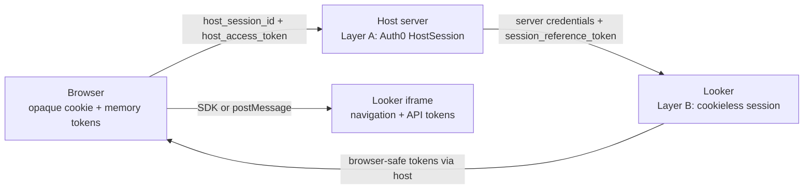

# Architecture: nested cookieless sessions

This lab demonstrates a design method: keep durable identity and renewal power
on the server, and give the browser only narrow, short-lived handles.

For setup and the demo, start with [README.md](README.md). For a shorter
question-and-answer version, read
[docs/cookieless-brief.md](docs/cookieless-brief.md). Coding tools start at
[AGENTS.md](AGENTS.md).

This page is the mental model. Token inventory, storage, renew functions,
User-Agent rules, logout steps, and embed-client detail live in
[docs/agent/CONTEXT.md](docs/agent/CONTEXT.md). File and route maps live in
[docs/agent/CODEMAP.md](docs/agent/CODEMAP.md).

## Why cookieless exists

A Looker iframe is normally cross-site. Its Looker session cookie is therefore a
third-party cookie, which browsers may block or partition. If Looker cannot
receive that cookie, it cannot recover the iframe's session in the usual way.

Cookieless embed makes the embedding application responsible for delivering
tokens. The host server calls privileged Looker APIs; the iframe asks for
short-lived tokens and never receives the long-lived Looker session reference.

## The two layers

| Layer | Role | Durable record | What the browser holds |
| --- | --- | --- | --- |
| A — host | Prove the user and authorize the BFF | In-memory `HostSession`, keyed by `host_session_id` | Opaque `HttpOnly` cookie plus short-lived `host_access_token` |
| B — Looker | Authorize the iframe | Looker's cookieless session, referenced by a server-held `session_reference_token` | One-use `authentication_token`, then `navigation_token` and `api_token` |

The nesting matters. Layer A gates every host endpoint that acquires, renews, or
ends Layer B. Layer B can end while the user remains logged into Layer A.

On `/lab`, constellation badges are **Auth0**, **Host**, or **Looker**. Layer A
includes both Auth0 tokens and host tokens. `host_access_token` is a **Host**
JWT. “Consumed by `/api/looker/*`” means it is the bearer that *gates* Looker
calls; it is not Looker's `api_token` and not Auth0's access token.

The cookie only finds the HostSession. The host JWT is the short-lived
authorization for protected BFF routes. Auth0 tokens and
`session_reference_token` never enter browser JSON, URLs, or browser storage.

## Lifetimes teach the nesting

Repository defaults used by this lab: host JWT **200** s
(`HOST_ACCESS_TOKEN_TTL_SECONDS` in `app/config.py`, not `.env`) and Looker
session length **720** s (`LOOKER_EMBED_SESSION_LENGTH`). The opaque host cookie
lasts hours so Layer A can outlive many Looker sessions. Auth0 durations come
from the tenant. Looker returns the individual authentication / navigation /
API / session-reference TTLs; the UI follows those values.

`navigation_token` and `api_token` are siblings, not aliases: usually minted
together, each with its own clock.

## Acquire, renew, and login are different operations

| Operation | Teaches |
| --- | --- |
| Auth0 code exchange | Prove the user and create Layer A |
| Host bootstrap / refresh | Keep Layer A callable without a new login |
| Looker acquire | Create or reattach Layer B; issue a new one-use authentication token |
| Looker generate | Rotate navigation and API tokens under the existing Layer B identity |

Renewal is not a new login. Generate uses the server-held session reference, not
an iframe-chosen one. Zero `session_reference_token_ttl` means Layer B is dead
(HTTP 409 `SESSION_DEAD`); Layer A may still be valid, so reacquiring Looker does
not necessarily require another Auth0 login.

## The iframe trust boundary

The iframe may request tokens with `session:tokens:request`. It may not choose
the session reference or call Looker's privileged acquire/generate APIs.

The two lab tabs implement the same boundary differently:

- **Embed SDK:** `initCookieless` invokes host callbacks and manages iframe
  messaging.
- **Raw postMessage:** the browser validates both `event.source` and the Looker
  origin, then sends only navigation/API token fields.

The diagram at [`docs/sequence-happy-path.mmd`](docs/sequence-happy-path.mmd),
also rendered at `/sequence`, shows the raw postMessage happy path. It is not a
complete SDK trace or failure matrix.

## User-Agent and embed-domain

Looker binds a cookieless session to client context. A different User-Agent on
generate commonly produces HTTP 400. The lab forwards the **current request**
User-Agent; the mismatch control is generate-only and does not mean “always the
login UA.” Acquire sends `APP_BASE_URL` as `embed_domain`. The same origin must
be accepted by Looker.

## What `session:expired` means

`session:expired`, or `session:status` with `expired=true`, is the iframe's
session-level signal that it cannot continue. It does not independently prove
that both sibling JWT clocks expired, and it does not revoke the server's
`session_reference_token`.

Treat nav/api clocks, iframe session status, and Layer B identity as three
questions, not one bit.

## Logout in more than one browser

Each Auth0 callback creates a separate `HostSession` and cookie. The in-memory
store is keyed only by `host_session_id`; it has no user index.

`POST /logout` tears down **this** browser's HostSession (Looker end, Auth0
refresh revoke, cookie clear, Auth0 logout). Another browser's HostSession is
not deleted by this repository.

A real logout-everywhere feature must index sessions by Auth0 `sub` and revoke
every matching HostSession, Auth0 refresh token, and Looker session. That is a
separate product choice, not a property provided automatically by cookieless
embed.

## Validity is checked by layer

There is no single global “logged in” bit.

| Question | Check |
| --- | --- |
| Can the host find the session? | Cookie maps to an existing, non-revoked `HostSession` |
| Can this browser call protected host APIs? | Host JWT verifies and its `jti` matches the current HostSession value |
| Can Layer A renew? | Auth0 accepts the server-held refresh token |
| Are iframe tokens current? | Each returned TTL/expiry remains positive |
| Can Layer B renew? | Generate succeeds and session-reference TTL is nonzero |
| Can the iframe continue? | Token checks plus iframe session status |

The lab's event log and token cards expose these checks separately so a failure
in one layer is not mislabeled as a global logout.

## Moving the pattern into a real application

Keep these boundaries:

1. **Identity adapter:** Auth0 authorize, callback, token refresh, and revoke.
2. **Host session repository:** durable, encrypted server storage; opaque cookie
   lookup; user index for logout-everywhere.
3. **Host token service:** mint and verify short-lived BFF access tokens.
4. **Looker bridge:** acquire, generate, and end; explicit server-only response
   filtering.
5. **Embed client adapter:** SDK or postMessage implementation with strict
   origin/source validation.
6. **Observability:** metadata and redacted events, never raw credentials.

Replace process memory with a shared server-side store before scaling beyond
one process. Keep token ownership and response filtering at the service
boundary rather than spreading them through route or UI code.
